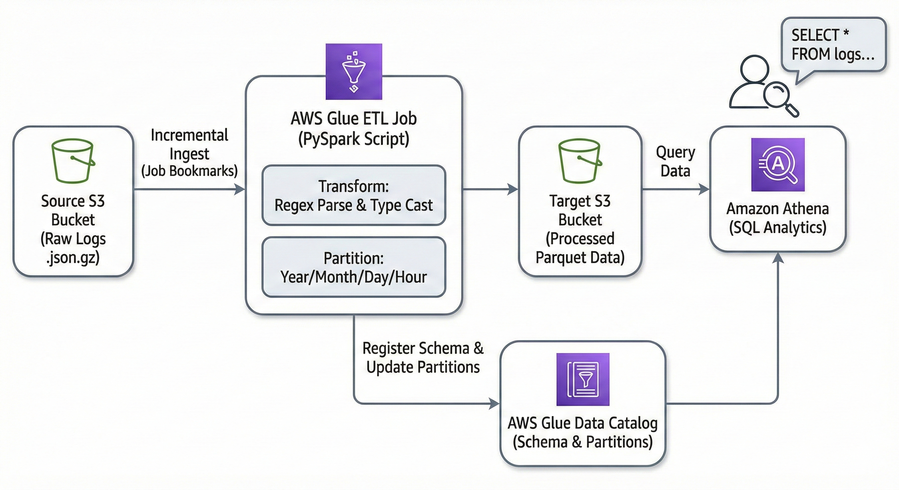

# Serverless-Log-Stream: Automated ETL Pipeline with AWS Glue & Spark

## Project Overview
This project demonstrates a production-ready, serverless ETL (Extract, Transform, Load) pipeline designed to process high-volume web server logs. Using **AWS Glue 4.0** and **Apache Spark**, the system ingests raw JSON-encapsulated Apache/Nginx logs, transforms them into a structured format using regular expressions, and stores them as partitioned Parquet files for high-performance analytics in **Amazon Athena**.

A key technical highlight of this project is the implementation of **AWS Glue Job Bookmarks**, which enables efficient incremental data loading by tracking processed state and avoiding redundant computations.

---

## Technical Architecture
* **Ingestion:** Raw `.json.gz` logs stored in **Amazon S3**.
* **Processing Engine:** **AWS Glue 4.0** (Spark 3.3, Python 3.10) using G.1X workers.
* **Data Transformation:** Complex string parsing via PySpark and `regexp_extract`.
* **Storage Layer:** Optimized **Apache Parquet** format with multi-level partitioning (`year/month/day/hour`).
* **Analytics:** Schema discovery and SQL querying via **Amazon Athena**.

---

## Solution Approach

### 1. Incremental Ingestion & State Management
To handle data efficiently at scale, the pipeline utilizes **Glue DynamicFrames** to enable Job Bookmarks. 
* **Transformation Context:** Each read/write operation uses a unique `transformation_ctx` to ensure the Glue service can track which S3 objects have already been processed.
* **Reliability:** This prevents data duplication during incremental loads, such as when adding new batches of log files to the source bucket.

### 2. Scalable Data Transformation
The PySpark script performs several critical transformations to turn raw strings into queryable data:
* **Regex Extraction:** Decomposes the standard Apache Combined Log Format into 11 distinct columns, including IP addresses, timestamps, and request methods.
* **Type Casting:** Converts status codes to `INT` and maps byte counts to `BIGINT`, specifically handling cases where missing data (represented as `-`) is converted to `NULL`.
* **Temporal Enrichment:** Parses raw timestamp strings into Spark `TimestampType` objects and derives time-based partitions for optimized storage.

### 3. Data Cataloging & Query Optimization
Rather than relying on automated crawlers, the pipeline uses **Explicit DDL** for the AWS Glue Data Catalog.
* **Partition Pruning:** By partitioning data by `year`, `month`, `day`, and `hour`, Athena queries can "skip" irrelevant data, significantly reducing costs and increasing query speed.
* **Metadata Repair:** Uses `MSCK REPAIR TABLE` to dynamically discover new partitions after incremental job runs.

---

## Performance Results
* **Initial Load:** Successfully processed **1.65 million records** from Batch 1.
* **Incremental Update:** Automatically identified and processed **850,000 new records** from Batch 2 without reprocessing the initial set.
* **Final Dataset:** Validated a total of **2.5 million records** queryable via Athena.

---

## Key Reflections
* **Why Spark?** For datasets of this scale (millions of records), traditional single-node scripts often fail due to memory constraints. Spark’s **distributed computing model** and **in-memory processing** allowed for horizontal scaling and faster execution of complex regex operations.
* **Challenges:** Configuring the interplay between Glue’s abstraction layer (DynamicFrames) and native Spark DataFrames required precise attention to `transformation_ctx` parameters to ensure state tracking remained active.
